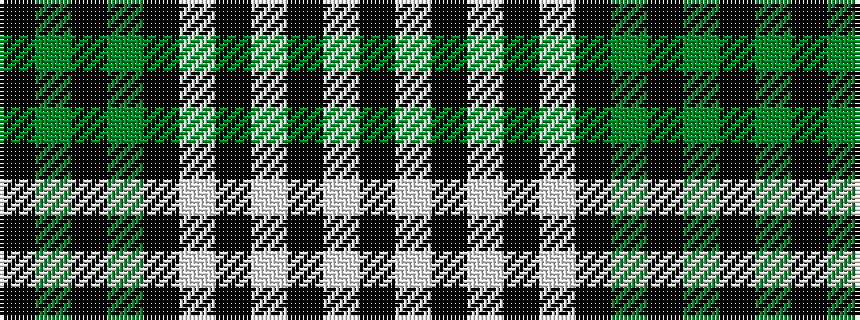

KGKGKWKWKWK

It is a 11 stripe tartan.

<figure class="pat-woven">

<figcaption>idealised sample</figcaption>
</figure>

## Colour Sequence



## Tartans with this colour sequence

| Tartans |
|---------------|
| [Royal Stuart / Stewart](/setts/s11/k14w4k14w19k4w4k4y4k16y11k8/)|
||
