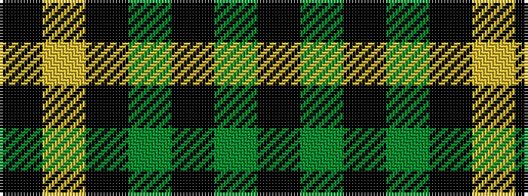

KGKGKYK

It is a 7 stripe tartan.

<figure class="pat-woven">

<figcaption>idealised sample</figcaption>
</figure>

## Colour Sequence



## Tartans with this colour sequence

| Tartans |
|---------------|
| [Grass of Rasunda (2009), The](/setts/s7/k14dg7k2y8k4lo2k1~x4/)|
||
| [Grass of Rasunda (Commemorative)](/setts/s7/k14dg7k2y8k4ly2k1~x4/)|
||
