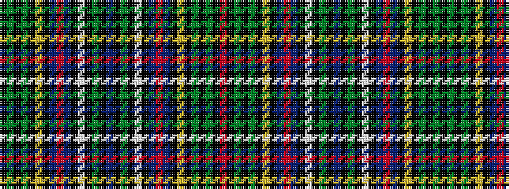

KGKGKYKBRBKWKGKBKGKWKBRBKYKGKGKR

It is a 32 stripe tartan.

<figure class="pat-woven">

<figcaption>idealised sample</figcaption>
</figure>

## Colour Sequence



## Tartans with this colour sequence

| Tartans |
|---------------|
| [Duncan of Sketraw Clan Tartan](/variants/s32/k6g2k2g14k1ly2k1b5r1b5k1w2k1g14k1b2k1g14k1w2k1b5r1b5k1ly2k1g14k2g2k6r2~x2/)|
||
