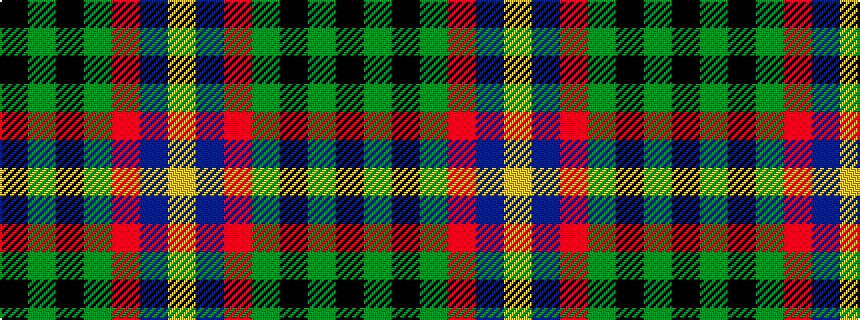

KGKGRBY

It is a 7 stripe tartan.

<figure class="pat-woven">

<figcaption>idealised sample</figcaption>
</figure>

## Colour Sequence



## Tartans with this colour sequence

| Tartans |
|---------------|
| [Selvon-Bruce (Personal)](/variants/s7/k3g2k3g18r2db2lo1~x4/)|
||
