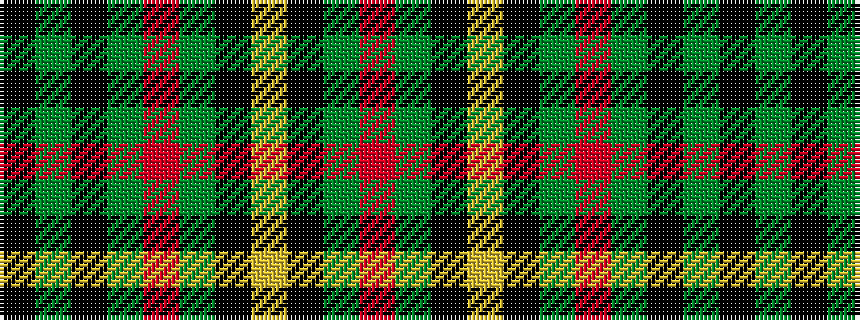

KGKGRGKYKGR

It is a 11 stripe tartan.

<figure class="pat-woven">

<figcaption>idealised sample</figcaption>
</figure>

## Colour Sequence



## Tartans with this colour sequence

| Tartans |
|---------------|
| [MacAart (Personal)](/setts/s11/r3g6k1lo1k1g6r2dy2k2dy9k2~x4/)|
||
