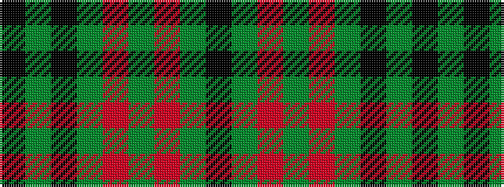

KGKGRGRGK

It is a 9 stripe tartan.

<figure class="pat-woven">

<figcaption>idealised sample</figcaption>
</figure>

## Colour Sequence



## Tartans with this colour sequence

| Tartans |
|---------------|
| [Gaelic Society of Moscow (Corporate)](/setts/s9/k15g2k2g4r2g2r2g2k2~x2/)|
||
