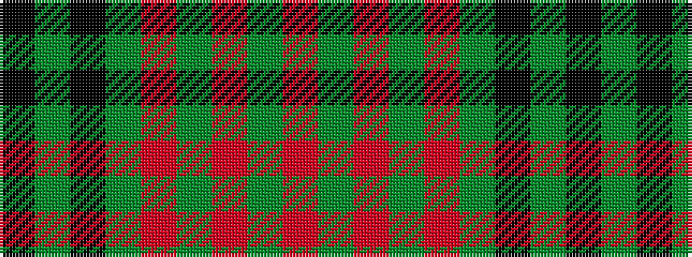

KGKGRGRGR

It is a 9 stripe tartan.

<figure class="pat-woven">

<figcaption>idealised sample</figcaption>
</figure>

## Colour Sequence



## Tartans with this colour sequence

| Tartans |
|---------------|
| [Carlow](/setts/s9/m20dg2m2dg2m2dg8k24dg2k3~x2/)|
||
