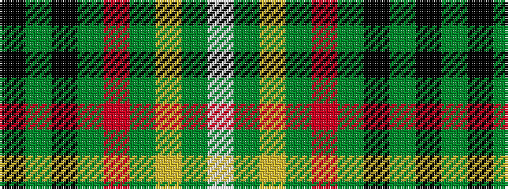

KGKGRGYGW

It is a 9 stripe tartan.

<figure class="pat-woven">

<figcaption>idealised sample</figcaption>
</figure>

## Colour Sequence



## Tartans with this colour sequence

| Tartans |
|---------------|
| [MacStumer Htg](/setts/s9/k3g14k8g8r3g4lo3g24w3~x2/)|
||
| [MacStumer Hunting](/setts/s9/k3dg14k8dg8r3dg4lo3dg24w3~x2/)|
||
