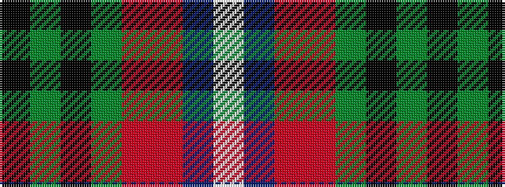

KGKGRRBW

It is a 8 stripe tartan.

<figure class="pat-woven">

<figcaption>idealised sample</figcaption>
</figure>

## Colour Sequence



## Tartans with this colour sequence

| Tartans |
|---------------|
| [Hebridean Celebration](/variants/s8/k1g6k6g1m2o2db6w1~x4/)|
||
