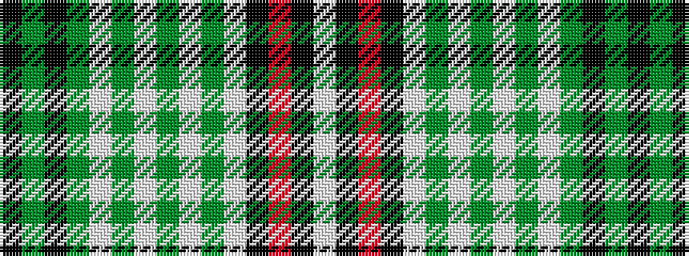

KGKGWGWGWGWKRKW

It is a 15 stripe tartan.

<figure class="pat-woven">

<figcaption>idealised sample</figcaption>
</figure>

## Colour Sequence



## Tartans with this colour sequence

| Tartans |
|---------------|
| [Black and White](/variants/s15/k19y6k3y15w3y12w9y3w20y3w20k19r4k5w3~x2/)|
||
