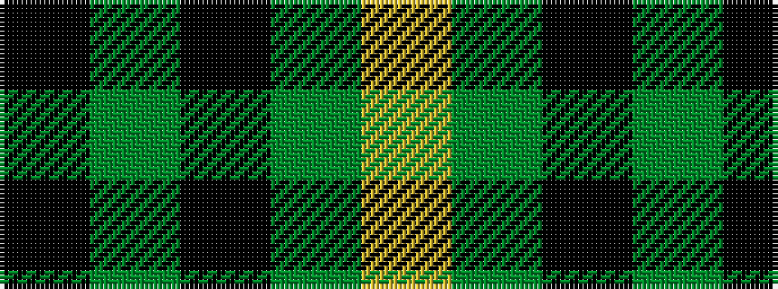

KGKGY

It is a 5 stripe tartan.

<figure class="pat-woven">

<figcaption>idealised sample</figcaption>
</figure>

## Colour Sequence



## Tartans with this colour sequence

| Tartans |
|---------------|
| [MacArthur](/variants/s5/k9g3k3g12ly2~x4/)|
||
| [MacArthur](/setts/k32dg6k12dg30ly3/)|
||
| [MacArthur](/variants/s5/k32g6k12g30ly3/)|
||
