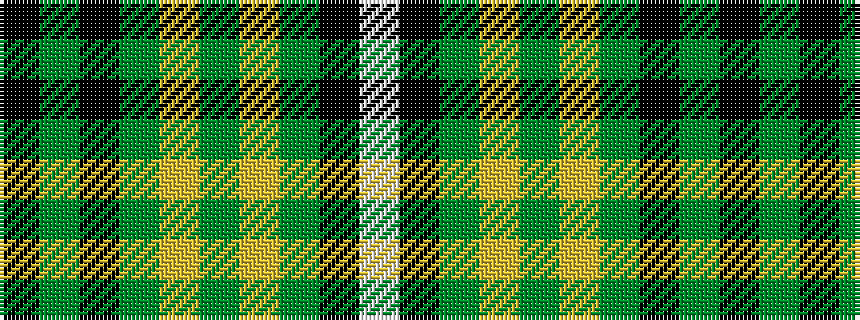

KGKGYGYGKW

It is a 10 stripe tartan.

<figure class="pat-woven">

<figcaption>idealised sample</figcaption>
</figure>

## Colour Sequence



## Tartans with this colour sequence

| Tartans |
|---------------|
| [University of Alberta (Corporate)](/setts/s10/k3dg32k2dg4ly4dg2ly4dg4k6w3~x2/)|
||
