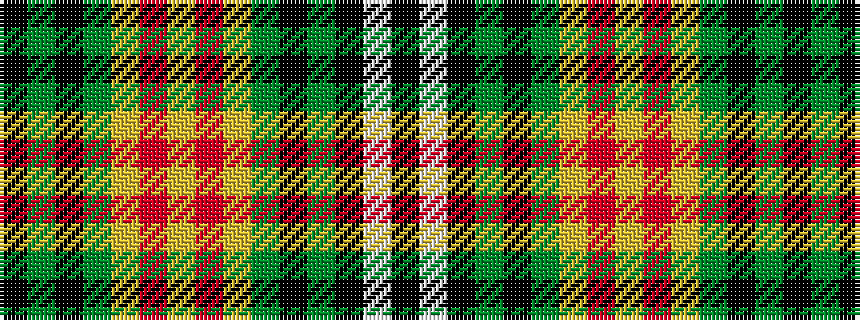

KGKGYRYRYGKGKWK

It is a 15 stripe tartan.

<figure class="pat-woven">

<figcaption>idealised sample</figcaption>
</figure>

## Colour Sequence



## Tartans with this colour sequence

| Tartans |
|---------------|
| [Confessore (Personal)](/setts/s15/k6y1k1y4ly1r1ly4r1ly2y4k1y1k8w1k2~x4/)|
||
