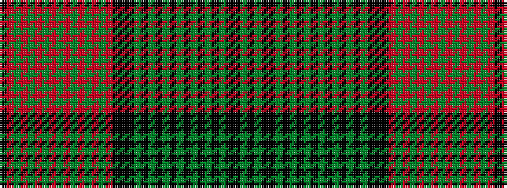

KGKKGKGKGKGKGKGKGKKKRGRGRGRGRGRGRGRK

It is a 36 stripe tartan.

<figure class="pat-woven">

<figcaption>idealised sample</figcaption>
</figure>

## Colour Sequence



## Tartans with this colour sequence

| Tartans |
|---------------|
| [New Brunswick (Commemorative)](/variants/s36/k50dg16k8ki8dg1ki1dg1ki1dg1ki1dg1ki1dg1ki1dg1ki1dg20ki40k12ki24r8dg1r1dg1r1dg1r1dg1r1dg1r1dg1r1dg28r6ki4/)|
||
