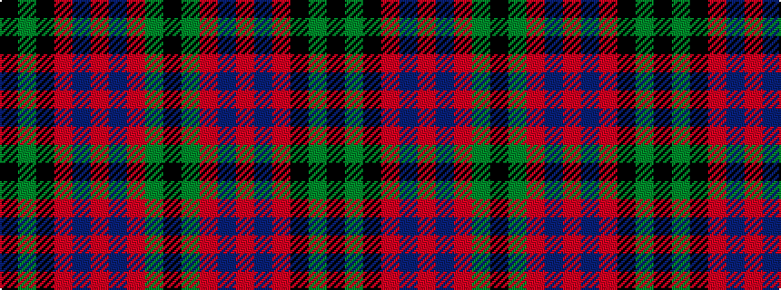

KGKRBRBRGK

It is a 10 stripe tartan.

<figure class="pat-woven">

<figcaption>idealised sample</figcaption>
</figure>

## Colour Sequence



## Tartans with this colour sequence

| Tartans |
|---------------|
| [MacInroy](/setts/k1g3k3r1db3r1db1r3g1k1/)|
||
| [MacInroy](/variants/s10/k1dg3k3r1db3r1db1r3dg1k1~x4/)|
||
| [MacInroy Clan Tartan](/variants/s10/k1g3k3r1dp3r1dp1r3g1k1~x4/)|
||
