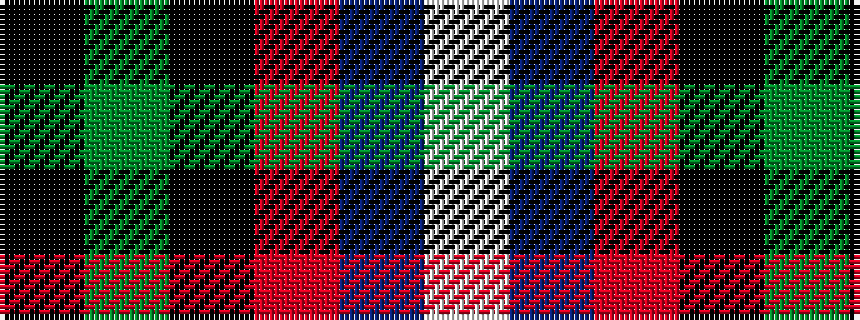

KGKRBW

It is a 6 stripe tartan.

<figure class="pat-woven">

<figcaption>idealised sample</figcaption>
</figure>

## Colour Sequence



## Tartans with this colour sequence

| Tartans |
|---------------|
| [Galbraith](/setts/s6/k2g17k16r2db17w2~x2/)|
||
| [Mitchell](/setts/s6/k2dg12k12r1db12lb2/)|
||
| [Mitchell Family Tartan Tartan Number: 2142. Earliest known date: 1816-20 Named in honour of General Billy Mitchell when it was adopted as the tartan of the United States Air Force pipe band. The sett is also known as Russell, Hunter and Galbraith. The earliest reference to the tartan is in the collection of the Highland Society of London where it is labelled Galbraith. See products available Copyright © Blair Urquhart, Comrie, 2015](/setts/s6/k3g8k8r2db8w2~x2/)|
||
| [Russell (Clan)](/setts/s6/k3g10k10r3db8w3~x2/)|
||
| [Russell or Mitchell or Hunter or Galbraith](/setts/s6/k2dg12k12r1db12w2~x2/)|
||
| [Russell, or Mitchell or Hunter or Galbraith](/setts/s6/k2g12k12r1db12w2~x2/)|
||
