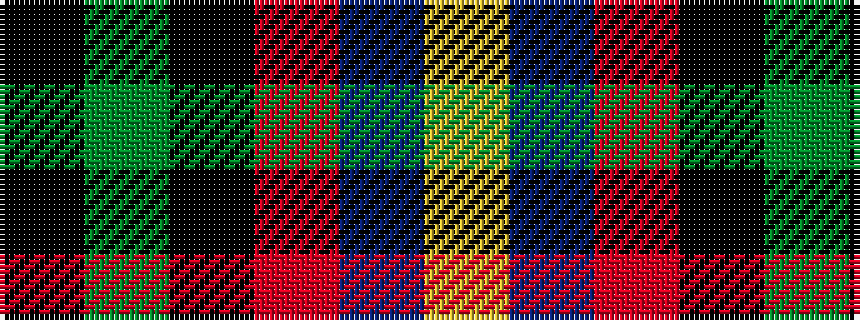

KGKRBY

It is a 6 stripe tartan.

<figure class="pat-woven">

<figcaption>idealised sample</figcaption>
</figure>

## Colour Sequence



## Tartans with this colour sequence

| Tartans |
|---------------|
| [Mitchell](/tartans/k2dg12k12r1db12lr2/)|
||
| [Mitchell (Clan)](/setts/s6/k2g17k16r2db17lr2~x2/)|
||
