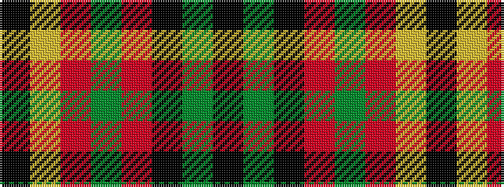

KGKRGRYK

It is a 8 stripe tartan.

<figure class="pat-woven">

<figcaption>idealised sample</figcaption>
</figure>

## Colour Sequence



## Tartans with this colour sequence

| Tartans |
|---------------|
| [Island of Innis, The](/setts/s8/k15dg1k3r9dg1r3lo11k1~x4/)|
||
