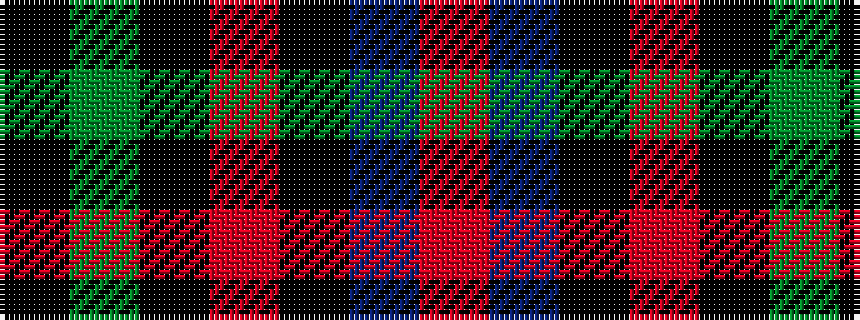

KGKRKBR

It is a 7 stripe tartan.

<figure class="pat-woven">

<figcaption>idealised sample</figcaption>
</figure>

## Colour Sequence



## Tartans with this colour sequence

| Tartans |
|---------------|
| [Confederate](/setts/s7/r12b18k1r4k1dg6k2~x2/)|
||
| [Confederate (Military)](/setts/s7/r12b18k1r4k1g6k2~x2/)|
||
