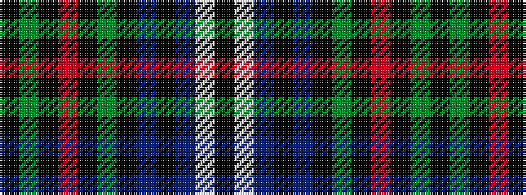

KGKRKGKBKBWK

It is a 12 stripe tartan.

<figure class="pat-woven">

<figcaption>idealised sample</figcaption>
</figure>

## Colour Sequence



## Tartans with this colour sequence

| Tartans |
|---------------|
| [Naomia Melvina Young Wedding Dress](/setts/s12/k4w1db26k5db5k32g23k2r4k2g13k2~x2/)|
||
| [Young, Melvina (Artefact)](/setts/s12/k4w1db26k5db5k32g23k2r4k2g13k1~x2/)|
||
