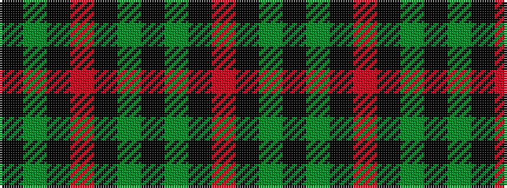

KGKRKGKGKR

It is a 10 stripe tartan.

<figure class="pat-woven">

<figcaption>idealised sample</figcaption>
</figure>

## Colour Sequence



## Tartans with this colour sequence

| Tartans |
|---------------|
| [Miyuki, Check Ecru Beige, No 1001A](/setts/s10/k40y1k1r9k1y1k6y1k1r9~x2/)|
||
