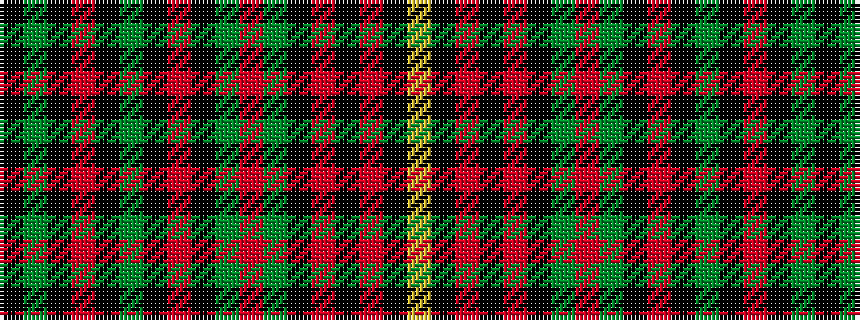

KGKRKGKRKGRGKRKRKY

It is a 18 stripe tartan.

<figure class="pat-woven">

<figcaption>idealised sample</figcaption>
</figure>

## Colour Sequence



## Tartans with this colour sequence

| Tartans |
|---------------|
| [New House Highland (Corporate)](/variants/s18/lo3k1r22k1r1k10dg1r1dg11k1r4k1dg8k1r4k1dg48k1~x2/)|
||
