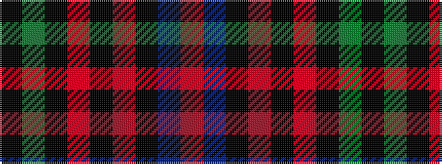

KGKRKRKBR

It is a 9 stripe tartan.

<figure class="pat-woven">

<figcaption>idealised sample</figcaption>
</figure>

## Colour Sequence



## Tartans with this colour sequence

| Tartans |
|---------------|
| [Guthrie](/setts/s9/k1g8k9r1k1r1k9db8r1~x6/)|
||
| [Guthrie (Name)](/setts/s9/k1g12k12r1k1r1k12b12r1~x4/)|
||
