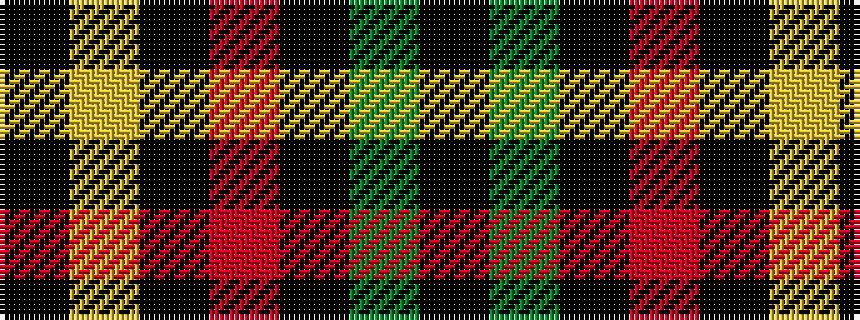

KGKRKYK

It is a 7 stripe tartan.

<figure class="pat-woven">

<figcaption>idealised sample</figcaption>
</figure>

## Colour Sequence



## Tartans with this colour sequence

| Tartans |
|---------------|
| [Langhein Family Tartan Tartan Number: 3235. Earliest known date: April 2002 Based on Black Watch Sett See products available Copyright © Blair Urquhart, Comrie, 2015](/setts/s7/k40dg15k10r2k10ly2k10~x2/)|
||
| [Langhein, Alex (Personal)](/setts/s7/k40dg15k10r2k10lo2k10~x2/)|
||
