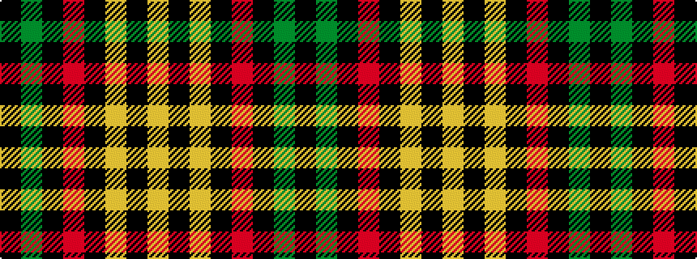

KGKRKYKY

It is a 8 stripe tartan.

<figure class="pat-woven">

<figcaption>idealised sample</figcaption>
</figure>

## Colour Sequence



## Tartans with this colour sequence

| Tartans |
|---------------|
| [Langhein, Alex (Personal)](/variants/s8/k40dg15k10r2k10lo2k10lo2~x2/)|
||
