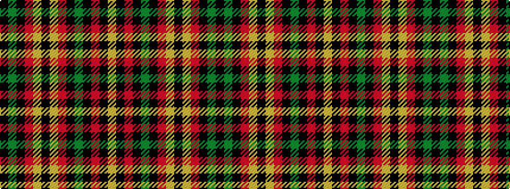

KGKRYKYRKGKRKY

It is a 14 stripe tartan.

<figure class="pat-woven">

<figcaption>idealised sample</figcaption>
</figure>

## Colour Sequence



## Tartans with this colour sequence

| Tartans |
|---------------|
| [Unknown U.S. kilt](/variants/s14/k10y3k28r28ly1k3ly1r10k1y3k1r28k28ly3~x2/)|
||
