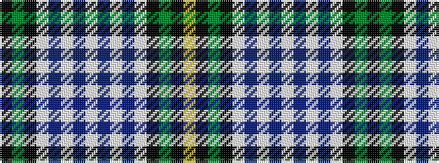

KGKWBWBWBWBWKGKY

It is a 16 stripe tartan.

<figure class="pat-woven">

<figcaption>idealised sample</figcaption>
</figure>

## Colour Sequence



## Tartans with this colour sequence

| Tartans |
|---------------|
| [Henderson Dress #1](/setts/s16/k6g4k1w16t1w4t6w1t6w4t1w16k1g4k6ly1~x2/)|
||
