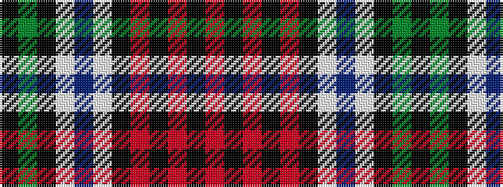

KGKWBWKRKRKR

It is a 12 stripe tartan.

<figure class="pat-woven">

<figcaption>idealised sample</figcaption>
</figure>

## Colour Sequence



## Tartans with this colour sequence

| Tartans |
|---------------|
| [Jardine, dress](/setts/s12/r26k2r6k2r6k20w2db44w2k6g64k3/)|
||
