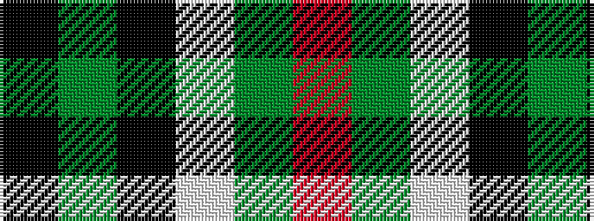

KGKWGR

It is a 6 stripe tartan.

<figure class="pat-woven">

<figcaption>idealised sample</figcaption>
</figure>

## Colour Sequence



## Tartans with this colour sequence

| Tartans |
|---------------|
| [Sir Billi (Corporate)](/setts/s6/r8g12w5k11g42k3~x2/)|
||
