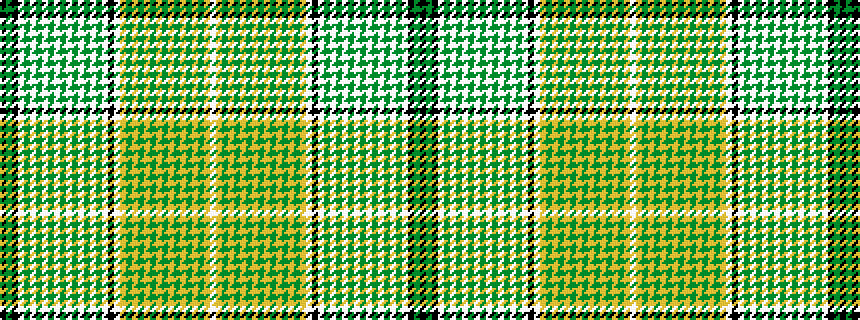

KGKWGWGWGWGWGWGWGWKWYGYGYGYGYGYGYGYW

It is a 36 stripe tartan.

<figure class="pat-woven">

<figcaption>idealised sample</figcaption>
</figure>

## Colour Sequence



## Tartans with this colour sequence

| Tartans |
|---------------|
| [Saskatchewan (Commemorative)](/variants/s36/k50g16k8w8g1w1g1w1g1w1g1w1g1w1g1w1g20w40k12w24ly8g1ly1g1ly1g1ly1g1ly1g1ly1g1ly1g28ly6w4/)|
||
