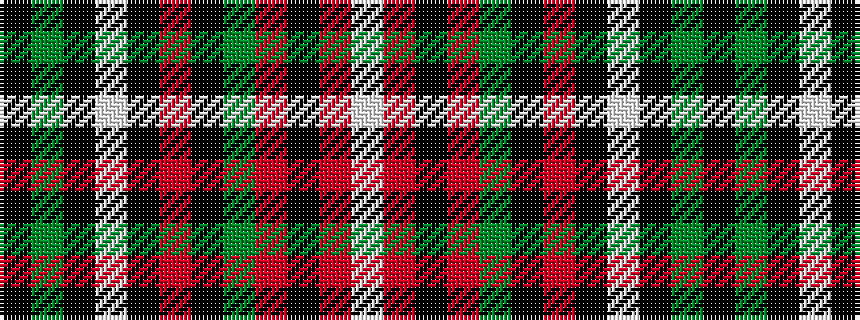

KGKWKRKGRKRW

It is a 12 stripe tartan.

<figure class="pat-woven">

<figcaption>idealised sample</figcaption>
</figure>

## Colour Sequence



## Tartans with this colour sequence

| Tartans |
|---------------|
| [Langtree](/setts/s12/k86y6k4w3k3r3k3y22o14k3o6w4/)|
||
