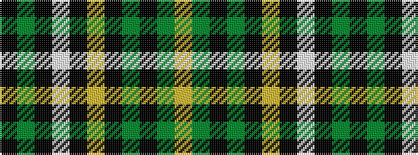

KGKWKYKGKGY

It is a 11 stripe tartan.

<figure class="pat-woven">

<figcaption>idealised sample</figcaption>
</figure>

## Colour Sequence



## Tartans with this colour sequence

| Tartans |
|---------------|
| [Initial City Link](/setts/s11/k50g7k4w2k2ly2k2g7k2g3ly2~x2/)|
||
| [Initial City Link #2](/setts/s11/k50dg7k4w2k2ly2k2dg7k2dg3ly2~x2/)|
||
