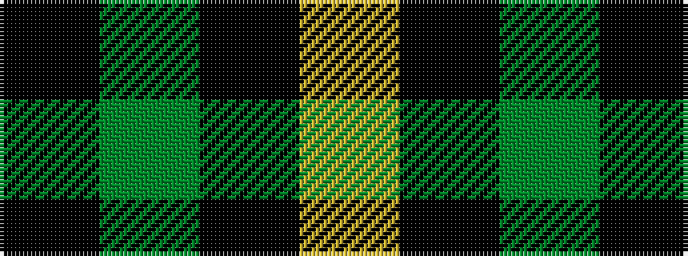

KGKY

It is a 4 stripe tartan.

<figure class="pat-woven">

<figcaption>idealised sample</figcaption>
</figure>

## Colour Sequence



## Tartans with this colour sequence

| Tartans |
|---------------|
| [Scotch Tape 2 (Corporate)](/setts/s4/k3g15k20ly3~x2/)|
||
| [Wallace Htg (Clan)](/setts/s4/k1g8k8ly1~x4/)|
||
| [Wallace Hunting](/setts/s4/k1dg8k8ly1/)|
||
| [Wallace, hunting](/setts/s4/k4g33k33ly4~x2/)|
||
