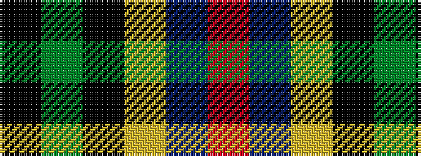

KGKYBR

It is a 6 stripe tartan.

<figure class="pat-woven">

<figcaption>idealised sample</figcaption>
</figure>

## Colour Sequence



## Tartans with this colour sequence

| Tartans |
|---------------|
| [Birse](/variants/s6/k4g16k14lo3n16r4~x2/)|
||
| [Birse](/variants/s6/k4g16k14ly3db16r4~x2/)|
||
