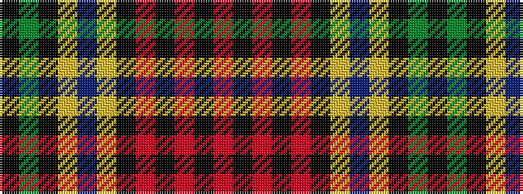

KGKYBYKRKRKR

It is a 12 stripe tartan.

<figure class="pat-woven">

<figcaption>idealised sample</figcaption>
</figure>

## Colour Sequence



## Tartans with this colour sequence

| Tartans |
|---------------|
| [Jardine Dress (Clan)](/setts/s12/r26k2r6k2r6k20lr2db44lr2k6dg64k3/)|
||
