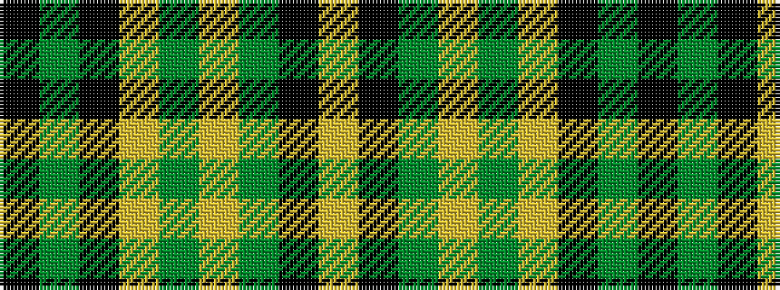

KGKYGYGKY

It is a 9 stripe tartan.

<figure class="pat-woven">

<figcaption>idealised sample</figcaption>
</figure>

## Colour Sequence



## Tartans with this colour sequence

| Tartans |
|---------------|
| [Leinster Ancestry](/variants/s9/k4dg33k18lo10g19lo3dg15k1ly3~x2/)|
||
