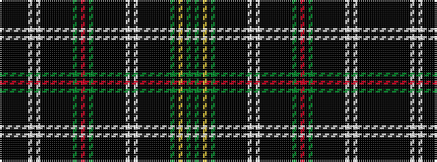

KGKYKGKKKKKKKKWKWKKKKKKKKGKRKGKKKKKKKKWKWKKKKKKK

It is a 48 stripe tartan.

<figure class="pat-woven">

<figcaption>idealised sample</figcaption>
</figure>

## Colour Sequence



## Tartans with this colour sequence

| Tartans |
|---------------|
| [Recovery hunting](/variants/s48/k1g8k1ly1k1g8k1ki1k1ki1k1ki1k1ki8w1ki2w1ki8k1ki1k1ki1k1ki1k1g8k1r1k1g8k1ki1k1ki1k1ki1k1ki8w1ki2w1ki8k1ki1k1ki1k1ki1~x4/)|
||
