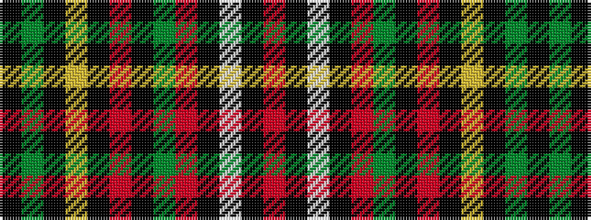

KGKYKRKGRKWKR

It is a 13 stripe tartan.

<figure class="pat-woven">

<figcaption>idealised sample</figcaption>
</figure>

## Colour Sequence



## Tartans with this colour sequence

| Tartans |
|---------------|
| [Quebec, Plaid du (District)](/variants/s13/k25dg5k2ly2ki2r2k2dg20r20ki2w2ki2r2~x2/)|
||
