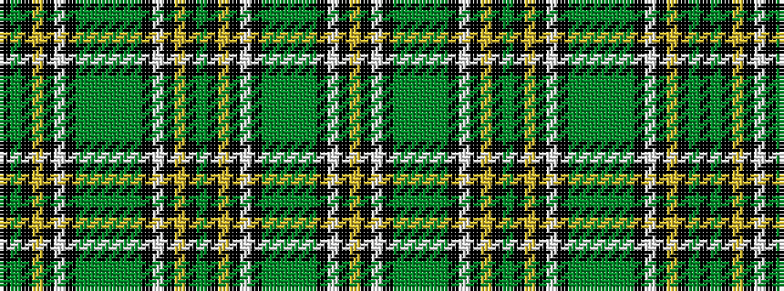

KGKYKWKGGGGGGKWKYKGKYKWKGGGGGKWKY

It is a 33 stripe tartan.

<figure class="pat-woven">

<figcaption>idealised sample</figcaption>
</figure>

## Colour Sequence



## Tartans with this colour sequence

| Tartans |
|---------------|
| [Hawick](/setts/s33/ly4k3w2k2dg12g2dg12g2dg12k2w2k3ly2k3g4k3ly2k3w2k2g12g2g12g12g2g12k2w2k3ly2k3g4k3~x2/)|
||
