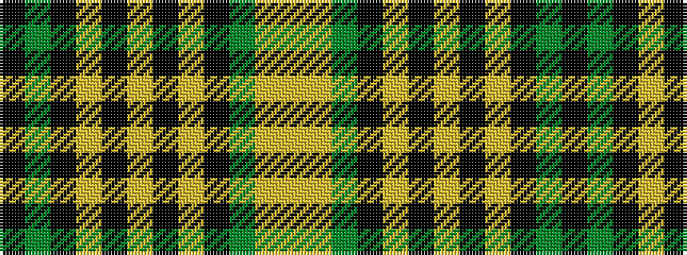

KGKYKYKYKGYY

It is a 12 stripe tartan.

<figure class="pat-woven">

<figcaption>idealised sample</figcaption>
</figure>

## Colour Sequence



## Tartans with this colour sequence

| Tartans |
|---------------|
| [Entier](/variants/s12/k2g4k6lr2k31ly2k1ly2k16g20ly1lr2~x2/)|
||
