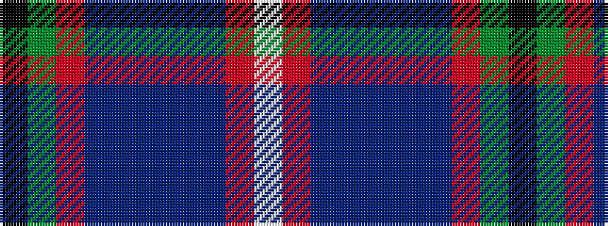

KGRBBBBBRW

It is a 10 stripe tartan.

<figure class="pat-woven">

<figcaption>idealised sample</figcaption>
</figure>

## Colour Sequence



## Tartans with this colour sequence

| Tartans |
|---------------|
| [Crieff Primary School](/setts/s10/k3g1o1dt6n2dt1n1dt1o10lb1~x4/)|
||
| [Crieff Primary School](/setts/s10/k3g1r1db6n2db1n1db1r10w1~x4/)|
||
