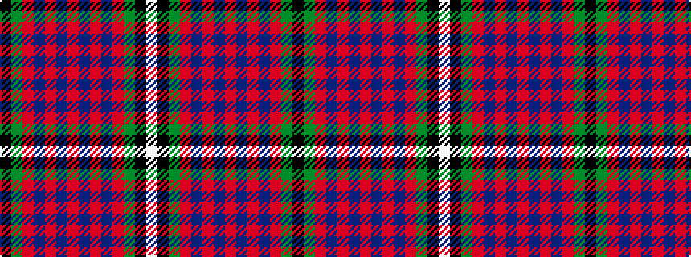

KGRBRBRBRBRGKW

It is a 14 stripe tartan.

<figure class="pat-woven">

<figcaption>idealised sample</figcaption>
</figure>

## Colour Sequence



## Tartans with this colour sequence

| Tartans |
|---------------|
| [MacGuire](/variants/s14/w5k3g15r3db6r15b3r3b3r3db3r15g15k3~x2/)|
||
