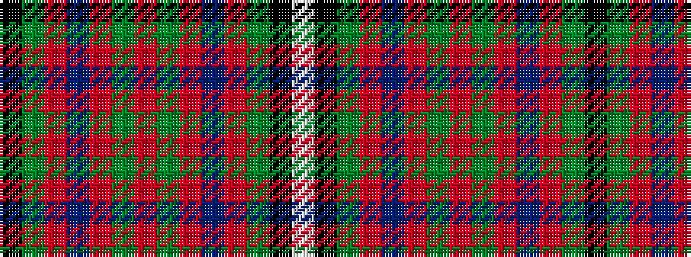

KGRBRGRGRBRGKW

It is a 14 stripe tartan.

<figure class="pat-woven">

<figcaption>idealised sample</figcaption>
</figure>

## Colour Sequence



## Tartans with this colour sequence

| Tartans |
|---------------|
| [MacGuire (Name)](/setts/s14/w3k2g18r2db9r18g2r2g2r2db2r3g18k2~x2/)|
||
| [MacGuire (Personal)](/setts/s14/w3k2dg18r2db8r18dg2r2dg2r2db2r18dg18k2~x2/)|
||
