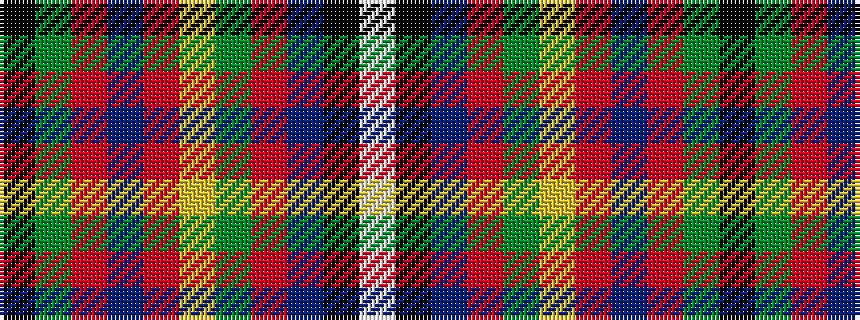

KGRBRYGRBKW

It is a 11 stripe tartan.

<figure class="pat-woven">

<figcaption>idealised sample</figcaption>
</figure>

## Colour Sequence



## Tartans with this colour sequence

| Tartans |
|---------------|
| [MacArthur-Fox Dress](/setts/s11/lb4k2db3r33dg9ly3r5db10r6dg2k2~x2/)|
||
