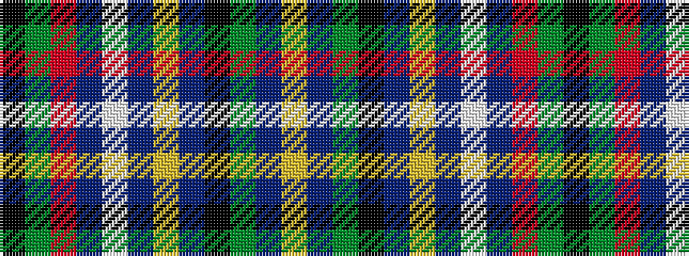

KGRBWBYBKGBY

It is a 12 stripe tartan.

<figure class="pat-woven">

<figcaption>idealised sample</figcaption>
</figure>

## Colour Sequence



## Tartans with this colour sequence

| Tartans |
|---------------|
| [London'88](/variants/s12/ly4db55y4k4db2ly2db2w5db3r2y2k2~x2/)|
||
