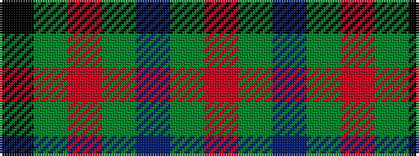

KGRGBGR

It is a 7 stripe tartan.

<figure class="pat-woven">

<figcaption>idealised sample</figcaption>
</figure>

## Colour Sequence



## Tartans with this colour sequence

| Tartans |
|---------------|
| [MacDona](/setts/s7/r35g52db18g17r12g17k18/)|
||
| [MacDonagh](/setts/s7/r20g29db10g16r6g10k19~x2/)|
||
| [MacDonagh (Name)](/setts/s7/r20dg29db10dg16r6dg10k19~x2/)|
||
