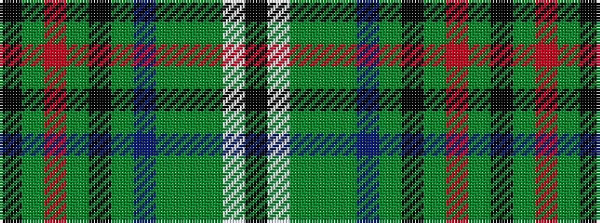

KGRGKGBGGGWK

It is a 12 stripe tartan.

<figure class="pat-woven">

<figcaption>idealised sample</figcaption>
</figure>

## Colour Sequence



## Tartans with this colour sequence

| Tartans |
|---------------|
| [MacClure Htg (Name)](/setts/s12/k2w1g2dy6g2dt4g2k2g15r2g2k1~x4/)|
||
