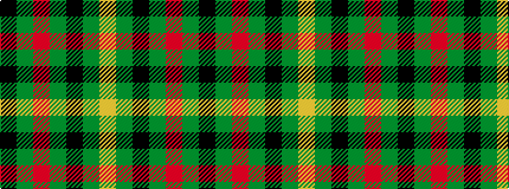

KGRGKGY

It is a 7 stripe tartan.

<figure class="pat-woven">

<figcaption>idealised sample</figcaption>
</figure>

## Colour Sequence



## Tartans with this colour sequence

| Tartans |
|---------------|
| [Welsh National (Fashion)](/variants/s7/k4dy2r2dy2k2dy15lo2~x4/)|
||
