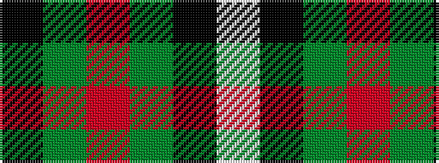

KGRGKW

It is a 6 stripe tartan.

<figure class="pat-woven">

<figcaption>idealised sample</figcaption>
</figure>

## Colour Sequence



## Tartans with this colour sequence

| Tartans |
|---------------|
| [Perratt (Personal)](/setts/s6/k83g4r4g10k1w3~x2/)|
||
