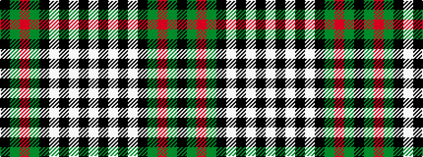

KGRGKWKWKW

It is a 10 stripe tartan.

<figure class="pat-woven">

<figcaption>idealised sample</figcaption>
</figure>

## Colour Sequence



## Tartans with this colour sequence

| Tartans |
|---------------|
| [Ferguson Dress variation](/variants/s10/lb8k4lb8k2lb3k8dg8r2dg8k4~x2/)|
||
